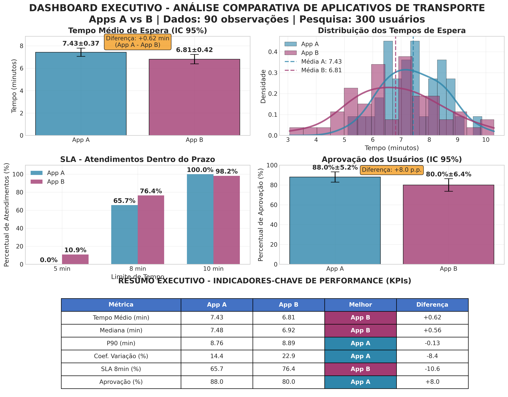

# Relatório Executivo: Análise Comparativa de Aplicativos de Transporte (A vs. B)

**Para:** Chefe de Análise de Dados  
**De:** Diogo Da Silva Rego  
**Data:** 23 de Setembro de 2025  
**Assunto:** Análise de performance e recomendação para incentivos entre os aplicativos de transporte A e B, com base em dados de tempo de espera e pesquisa de satisfação.

---

## 1. Resumo das Conclusões e Recomendações

Esta análise avaliou os aplicativos A e B em duas frentes críticas: **eficiência operacional** (tempo de espera) e **aceitação pelo usuário** (pesquisa de opinião). Os resultados indicam uma troca clara entre os dois serviços:

*   **Aplicativo B é mais rápido:** Apresenta um tempo médio de espera **0.62 minutos (37 segundos) menor** que o App A, uma diferença estatisticamente significativa (p < 0.05).
*   **Aplicativo A é mais consistente e mais bem avaliado:** Possui uma variabilidade de tempo **38% menor** (Coeficiente de Variação de 14.4% vs. 22.9% do App B), tornando-o um serviço mais previsível. Além disso, sua taxa de aprovação é de **88%**, contra 80% do App B.

**Recomendação Principal:**

A decisão de incentivo depende do objetivo estratégico prioritário da prefeitura:

1.  **Se o objetivo é minimizar o tempo de espera médio:** O **Aplicativo B** deve ser incentivado, pois é consistentemente mais rápido na média.
2.  **Se o objetivo é garantir um serviço previsível e com maior satisfação do usuário:** O **Aplicativo A** é a melhor escolha, devido à sua menor variabilidade e maior taxa de aprovação.

Considerando que a previsibilidade (menor variabilidade) e a satisfação do usuário são fatores cruciais para a confiança no serviço público, **a recomendação pende favoravelmente para o Aplicativo A**. A consistência do serviço tende a gerar uma experiência mais positiva a longo prazo, mesmo com um tempo médio ligeiramente superior.

---

## 2. Dashboard Executivo: Visão Geral dos Resultados

O painel abaixo resume os indicadores-chave de performance (KPIs) que fundamentam esta análise. Ele oferece uma comparação visual direta entre os dois aplicativos.

---

## 3. Análise Detalhada dos Indicadores

A tabela a seguir detalha os principais pontos da análise, respondendo às questões levantadas pela gestão.

| Métrica-Chave | Pergunta do Gestor | Aplicativo A | Aplicativo B | Conclusão Estatística | Implicação para a Decisão |
| :--- | :--- | :--- | :--- | :--- | :--- |
| **Tempo Médio** | Qual app tem menor tempo de espera? | 7.43 min | **6.81 min** | A diferença de 0.62 min é **significativa** (p=0.027). | O App B é, em média, mais rápido. |
| **Consistência** | Qual app é mais previsível? | **14.4% (CV)** | 22.9% (CV) | A variabilidade do App B é **significativamente maior** (p=0.022). | O App A oferece uma experiência mais consistente e confiável. |
| **Aceitação** | Qual app é mais aceito pelos usuários? | **88%** | 80% | A diferença de 8 p.p. é **significativa a 90% de confiança**, mas não a 95%. | O App A tem uma vantagem na percepção pública, embora a evidência estatística seja moderada. |
| **SLA (8 min)** | Qual app cumpre melhor as metas? | 65.7% | **76.4%** | O App B atende mais usuários em até 8 minutos. | O App B é mais eficaz para metas de tempo de atendimento mais curtas. |

### Interpretação dos Resultados

*   **Tempo de Espera vs. Consistência:** Embora o App B seja mais rápido na média, ele também é mais imprevisível. O tempo de espera do App B tem uma variação maior, o que pode levar a picos de espera frustrantes para o usuário, mesmo que a média seja menor. O App A, por outro lado, entrega um serviço com tempo mais estável.

*   **Diferença de Médias:** A análise de inferência estatística (Teste t de Welch) confirma que a diferença no tempo médio de espera não é obra do acaso. Com 95% de confiança, podemos afirmar que o App B é de fato mais rápido que o App A.

*   **Diferença de Proporções:** A maior aprovação do App A (88% vs 80%) é estatisticamente significativa com 90% de confiança. Isso sugere que, apesar de um pouco mais lento, a consistência e talvez outros fatores (qualidade do veículo, atendimento do motorista) contribuem para uma melhor percepção do usuário.

---

## 4. Próximos Passos

1.  **Discutir o Foco Estratégico:** Apresentar esta análise aos gestores para definir se a prioridade é **velocidade média** (vantagem do App B) ou **confiabilidade e satisfação** (vantagem do App A).
2.  **Modelo de Incentivo Híbrido:** Considerar um modelo de incentivo que premie ambos os aplicativos com base em diferentes métricas. Por exemplo, um incentivo base para o App A por sua consistência e satisfação, e um bônus de performance para o App B por manter o tempo médio baixo.
3.  **Análise de Custo-Benefício:** Se houver dados de custo, aprofundar a análise para calcular o custo por minuto reduzido ou por ponto percentual de satisfação ganho, otimizando o investimento público.
